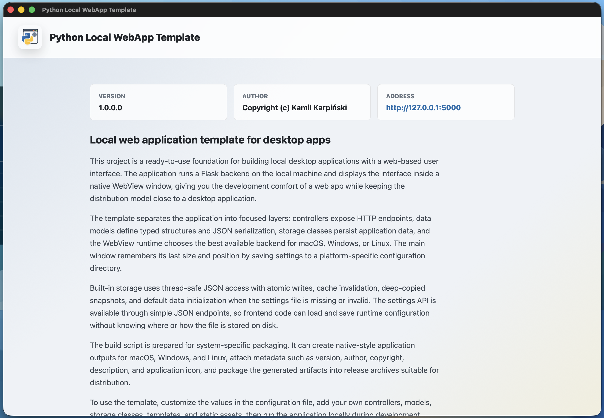

# PythonLocalWebAppTemplate

## Languages

- [English](README.md)
- [Polski](README_pl-PL.md)

---

A local Python web application template that runs a Flask backend on the user's machine and displays the interface in a native desktop window through PyWebView.



## What the Application Does

The application starts a local HTTP server at `127.0.0.1:5000`, renders an HTML view from the `templates` directory, serves static assets from `assets`, and then opens that address in a WebView window. This gives the project the development model of a web application while keeping the runtime experience close to a simple desktop app for macOS, Windows, and Linux.

The current start view displays application information: name, version, author, and the local service address. The project also includes a ready-made mechanism for saving the window size and screen position.

## Why It Was Created

This project is a starting point for building local desktop tools with a web-based interface. It removes repetitive infrastructure from the application layer: starting a local backend, choosing the WebView backend, storing settings, organizing controllers, models and storage, and packaging the application for distribution.

## Key Features

- Local Flask backend running in a separate thread.
- Native application window created with PyWebView.
- Automatic WebView backend selection for macOS, Windows, and Linux.
- WebView runtime availability validation on Windows and Linux.
- HTML template rendering through Jinja2.
- Static application assets in the `assets` directory.
- HTTP controllers based on Flask Blueprint.
- `GET /settings` and `POST /settings` endpoints for reading and saving settings.
- Thread-safe JSON storage with caching, atomic writes, and default data initialization.
- Window size and position persistence after closing the application.
- PyInstaller build script that creates a release package for the current operating system.

## Python Version

The project was verified locally with:

```text
Python 3.13.14
```

The run scripts use the interpreter from `.venv` when it exists. Otherwise, they use `python3` on macOS/Linux or `python` on Windows.

## Technologies

- Python 3.13.14
- Flask 3.1.3
- Jinja2 3.1.6
- Werkzeug 3.1.8
- pywebview 6.2.1
- PyInstaller 6.20.0
- Pillow, used during the build process
- HTML and CSS for the UI layer
- JSON as the local settings format

The complete dependency list is available in `requirements.txt`.

## File Structure

```text
.
|-- app.py                         # Main application entry point
|-- config.py                      # Runtime application configuration
|-- build.py                       # Clean, dependency install, build, and release script
|-- build_conf.py                  # Build process configuration
|-- requirements.txt               # Python dependencies
|-- run.sh / run.bat               # Run the application locally
|-- build.sh / build.bat           # Run the build process
|-- cleanup.sh / cleanup.bat       # Remove __pycache__ directories
|-- assets/
|   |-- icons/                     # Application icons
|   `-- index/index.css            # Styles for the start view
|-- templates/
|   `-- index/index.html           # Main view template
|-- controllers/
|   |-- window_controller.py       # / route and UI rendering
|   `-- settings_controller.py     # /settings endpoints
|-- core/
|   |-- api/base_controller.py     # Base Flask Blueprint controller
|   |-- models/                    # Data models and serialization
|   |-- storage/                   # JSON storage and application settings
|   `-- service.py                 # Local Flask server
|-- utils/
|   |-- path_utils.py              # Platform-specific settings paths
|   `-- webview_runtime.py         # WebView runtime selection and validation
`-- doc/
    `-- screenshot.png             # Application screenshot used in README
```

## Scripts

### Running the Application

macOS/Linux:

```sh
./run.sh
```

Windows:

```bat
run.bat
```

The script switches to the project directory, selects the local `.venv` interpreter when available, and runs `app.py`.

### Building the Application

macOS/Linux:

```sh
./build.sh
```

Windows:

```bat
build.bat
```

The scripts run `build.py`. The build process performs the following steps:

1. Removes `bin/dist`, `bin/build`, `bin/release`, and generated helper files.
2. Upgrades `pip`.
3. Installs dependencies from `requirements.txt`.
4. Installs the build tools `pyinstaller` and `pillow`.
5. Builds the application with PyInstaller for the current operating system.
6. Adds application metadata and packages the output into `bin/release`.

Build outputs are written to:

- `bin/dist` - generated application.
- `bin/build` - PyInstaller working files.
- `bin/release` - release archive and `APP_METADATA.txt`.

### Cleaning Python Cache

macOS/Linux:

```sh
./cleanup.sh
```

Windows:

```bat
cleanup.bat
```

The scripts remove `__pycache__` directories from the project.

## Application Configuration Parameters

Runtime configuration is defined in `config.py`.

| Parameter | Meaning | Default value |
| --- | --- | --- |
| `APP_NAME` | Application name and window title | `Python Local WebApp Template` |
| `APP_AUTHOR` | Application author | `Kamil Karpinski` |
| `APP_DESCRIPTION` | Application description also used during build | Local web application template |
| `APP_VERSION` | Application version | `1.0.0.0` |
| `HOST` | Local Flask server host | `127.0.0.1` |
| `PORT` | Local Flask server port | `5000` |
| `SERVICE_TIMEOUT` | Maximum wait time for server startup | `10` seconds |
| `STATIC_FOLDER` | Static assets directory | `assets` |
| `STATIC_URL_PATH` | Public static assets path | `/assets` |
| `TEMPLATE_FOLDER` | HTML templates directory | `templates` |
| `APP_ICON` | PNG icon used outside Windows, among other cases | `assets/icons/favicon.png` |
| `APP_ICON_WINDOWS` | ICO icon for Windows | `assets/icons/favicon.ico` |
| `SETTINGS_DIR` | System-specific application settings directory | Calculated by `PathUtils` |
| `SETTINGS_FILE_NAME` | Settings file name | `settings.json` |

User settings are stored in a system-specific configuration directory:

- Windows: `%APPDATA%/<APP_NAME without spaces>`
- macOS: `~/Library/Application Support/<APP_NAME without spaces>`
- Linux: `$XDG_CONFIG_HOME/<APP_NAME without spaces>` or `~/.config/<APP_NAME without spaces>`

Default window settings are defined in `core/models/settings_data_model.py`:

| Parameter | Default value |
| --- | --- |
| `window_width` | `1200` |
| `window_height` | `800` |
| `window_pos_x` | `100` |
| `window_pos_y` | `100` |

## Build Parameters

Build configuration is defined in `build_conf.py`.

| Parameter | Meaning | Default value |
| --- | --- | --- |
| `ROOT_DIR` | Project root directory | Directory containing `build_conf.py` |
| `BIN_DIR` | Build files directory | `bin` |
| `BUILD_DIR` | PyInstaller working directory | `bin/build` |
| `DIST_DIR` | PyInstaller output directory | `bin/dist` |
| `RELEASE_DIR` | Release packages directory | `bin/release` |
| `BUILD_FOLDERS` | Directories included with `--add-data` | `assets`, `templates` |
| `ENTRY_FILE` | PyInstaller application entry point | `app.py` |
| `RELEASE_METADATA_FILE` | Release metadata file name | `APP_METADATA.txt` |
| `WINDOWS_VERSION_FILE` | Generated Windows version metadata file | `bin/version_info.txt` |
| `MACOS_APP_NAME` | Technical macOS application name | `python-local-webapp-template` |
| `MACOS_BUNDLE_IDENTIFIER` | macOS bundle identifier | `com.example.python-local-webapp-template` |
| `MACOS_CATEGORY_TYPE` | macOS application category | `public.app-category.developer-tools` |

The build uses application metadata imported from `config.py`, including `APP_NAME`, `APP_AUTHOR`, `APP_DESCRIPTION`, `APP_VERSION`, and PNG/ICO icons.

PyInstaller runs with:

- `--windowed` - no system console.
- `--onedir` - application packaged as a directory.
- `--clean` and `--noconfirm` - clean build without interactive prompts.
- `--add-data` for directories from `BUILD_FOLDERS`.

Release packages are created per operating system:

- Windows: ZIP archive from `bin/dist/<APP_NAME>`.
- macOS: ZIP archive with the `.app` bundle, created with `ditto`.
- Linux: `tar.gz` archive from `bin/dist/<APP_NAME>`.

## Endpoints

| Method | Path | Description |
| --- | --- | --- |
| `GET` | `/` | Renders the main application view. |
| `GET` | `/settings` | Returns window settings as JSON. |
| `POST` | `/settings` | Saves window settings from a JSON payload. |

When the window closes, the application saves its current size and position. On the next launch, it restores them from `settings.json`.
